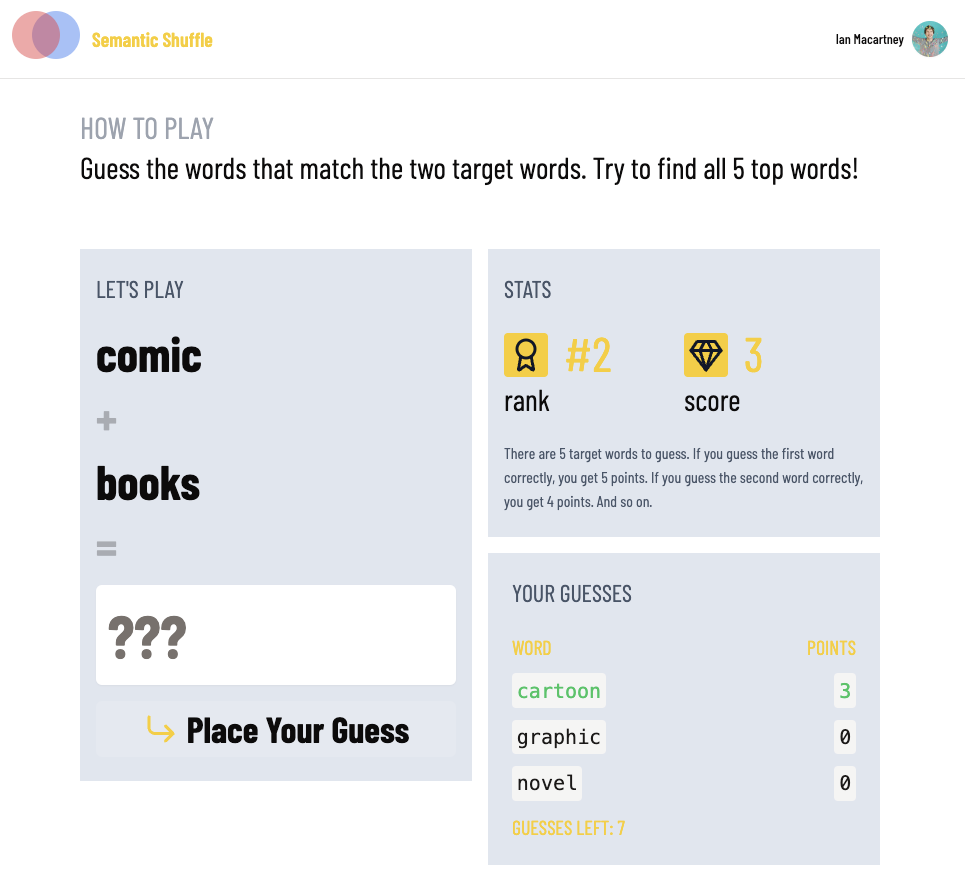

# Mid Meaning - A Guessing Game with AI embeddings



This explores the midpoint of embeddings using centroid, reciprocal rank fusion, and more.

The game is live at [labs.convex.dev/mid-embeddings](https://labs.convex.dev/mid-embeddings).

## Setting up

```sh
npm i
npm run setup
npx @convex-dev/auth
npx convex env set LLM_API_KEY # OpenAI API Key
npm run dev
```

## Setting up GitHub OAuth

Make a GitHub OAuth app:

`https://github.com/organizations/your-org-here/settings/applications`

Set the callback to `https://your-project-123.convex.site/api/auth/callback/github`
where you find your-project-123 in .env.local.

```sh
npx convex env set AUTH_GITHUB_ID # GitHub OAuth ID
npx convex env set AUTH_GITHUB_SECRET # GitHub OAuth Secret
```

To configure different authentication methods, see [Configuration](https://labs.convex.dev/auth/config) in the Convex Auth docs.

## Adding words

Here are some links you can use to seed words:

750 feelings (like "amazed"):

https://gist.githubusercontent.com/ianmacartney/3f6424b4862eb22dd097f6722a105c43/raw/806f9ae12fa604d394436f3c32b286e8e14379a5/750-feelings.json

Top 250 movies according to imdb, with the text of "The movie X":

https://gist.githubusercontent.com/ianmacartney/c25f237e5644bea5c88fedd1067fda28/raw/6fde9cd60a0c9ac352da6bbfa8791a269b701f0a/top-250-movies.json

US States:

https://gist.githubusercontent.com/ianmacartney/e38faee2e20aee5c625e4e1d5940ac65/raw/2e37747dc6c08ec633ce52fcac26036f3e3fb201/us-states.json

US Presidents:

https://gist.githubusercontent.com/ianmacartney/f9e7377283168c9f37cda838c3503e03/raw/588884c7646a9c0ab705babe636429882f3fc8af/presidents.json

10k common words:

https://gist.githubusercontent.com/ianmacartney/77f89f7ce3568e3f337c8c4c9623d224/raw/8dbfb96adc8a4c01175eb11fad31166e65c2e6aa/10k-words.json

Omitting swear words and words shorter than 3 characters:

https://gist.githubusercontent.com/ianmacartney/97bea1a523b39a35dfa9455c2ee1bfb9/raw/7c69b91de71d5882ab894bc87e9c56cd411d265b/10k-words-no-swears-min-length-3.json

The same, with at least 4 characters:

https://gist.githubusercontent.com/ianmacartney/a6ae8e5bb6e8b27fa3f98b54b2c0690e/raw/1946ad45d96380a3a8e39db6d681e483042716ed/10k-words-no-swears-min-length-4.json

Words from Google's 10k most common words, de-duping on stemmed words,
without swears, at least 3 characters:

https://gist.githubusercontent.com/ianmacartney/d4f664d3f8e63845a77f519f2709ab05/raw/d2508f553b42444589d5ecc134b8a3c91b2a5b2a/google-10000-english-usa-no-swears-stemmed-min-3-chars.json

Another great resource:

https://github.com/first20hours/google-10000-english
